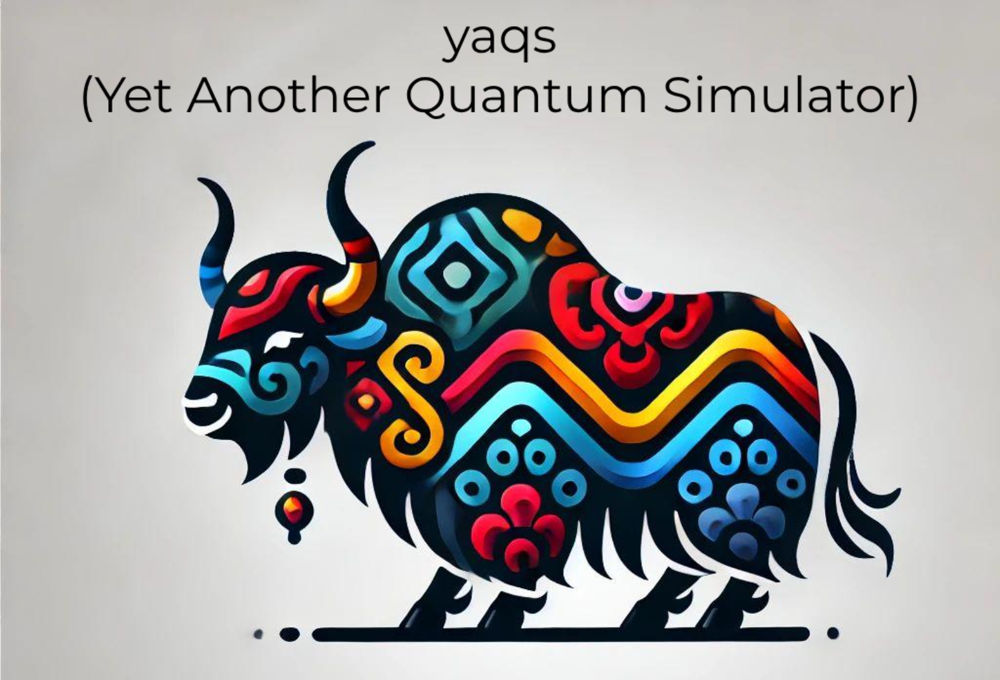

## NOTE: This is an early alpha version released to provide code for various related works. A full release will come later once more features are added.

# YAQS
YAQS (pronounced "yaks" like the animals) is a Python library, primarily focused on simulating open quantum systems, noisy quantum circuits, and designing realistic quantum hardware.

## Features
- **Simulation of Open Quantum Systems**: Simulate large-scale open quantum systems with a paralellized implementation using the Tensor Jump Method (TJM)
- **Equivalence Checking of Quantum Circuits**: Check the equivalence or non-equivalence of quantum circuits with a scalable MPO-based method ([Equivalence Checking of Quantum Circuits via Intermediary Matrix Product Operator](https://arxiv.org/abs/2410.10946))

## Upcoming Features (Check back soon)
- **WIP: Noisy Quantum Circuit Simulation**: Investigate the effect of noise on large quantum circuits
- **WIP: Quantum Hardware Design**: Design better quantum hardware with realistic simulation methods

## Installation

1. Clone this repository:
```bash
   git clone https://github.com/aaronleesander/YAQS.git
   cd yaqs
```

2. Create and activate a virtual environment:

On macOS/Linux
```bash
python -m venv venv
source venv/bin/activate
```

On Windows (PowerShell)
```bash
python -m venv venv
.\venv\Scripts\activate.ps1
```

3. Install YAQS in editable mode so that your changes appear immediately:
```bash
pip install -e .
```

4. Check the ```yaqs/examples``` folder for usage details.

## Contributing
Fork the repository and clone your fork.
Create a new branch for your changes.
Commit and push your work, then open a Pull Request.

## Questions, Comments, Thoughts?
If you have anything you want to share or collaboration ideas, feel free to reach out!

Email: [aaron.sander@tum.de](mailto:aaron.sander@tum.de)

LinkedIn: [https://www.linkedin.com/in/aaron-sander/](https://www.linkedin.com/in/aaron-sander/)

## Citations
If you use this code in your research, please consider citing the relevant papers:

[Equivalence Checking of Quantum Circuits via Intermediary Matrix Product Operator](https://arxiv.org/abs/2410.10946)
